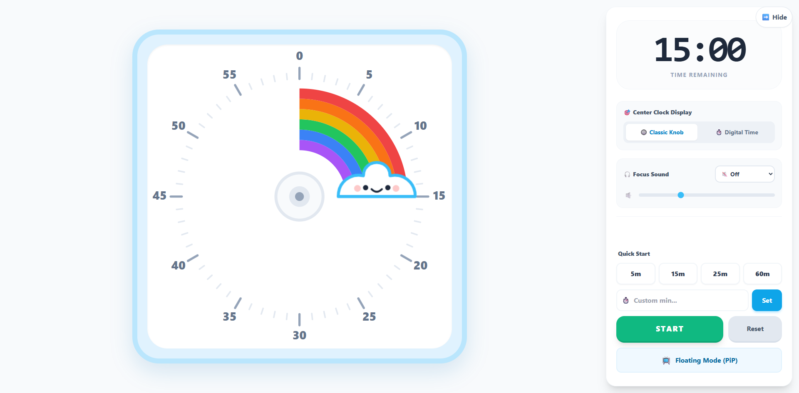

# ☁️ Cloud Rainbow Timer 🌈


*(Note: You can replace the image link above with a screenshot of your app later)*

**Live Demo:** [https://cloud-rainbow-timer.vercel.app/](https://cloud-rainbow-timer.vercel.app/)

Cloud Rainbow Timer is an interactive, web-based visual focus timer designed to minimize visual noise and provide a more calming time-tracking experience.

## 💭 Why I Built This

I often struggle with tracking time mentally (time blindness). On the other hand, using conventional digital timers can feel intimidating; the constantly ticking numbers can sometimes trigger anxiety and sensory overload. 

I needed a focus tool that is:
1. **Highly Visual:** Seeing the remaining time as shrinking color blocks (a rainbow) is much easier for the brain to process than reading raw digital numbers.
2. **Visually Quiet:** The minute numbers are placed outside the circle, providing ample breathing room (white space) so the eyes don't get easily fatigued.
3. **Fun & Rewarding:** There is a small cloud character that acts as a "wiper". Watching this cloud slowly move and eat up the rainbow provides a small visual dopamine boost that makes the process of waiting or focusing feel less like a chore.

This app was built as a self-healing solution and a sensory-friendly personal productivity tool.

## ✨ Key Features

- **Visual Time Wiper:** A dynamic SVG cloud character that rotates and smoothly erases the rainbow ring as time passes.
- **Synthesized Focus Sounds:** Equipped with built-in Deep Brown Noise and Soft Pink Noise to block out external distractions. These sounds are generated directly by the browser (Web Audio API), meaning zero delay, infinite looping, and no internet bandwidth usage.
- **Low Cognitive Load UI:** Options to hide the digital clock (replacing it with a classic knob) and hide the sidebar for a completely clean, distraction-free center screen.
- **Picture-in-Picture (PiP) Mode:** The timer can be popped out into a small floating window that always stays on top of other applications.
- **Soft Alarms:** Gentle, non-startling multi-chime alarm sounds when the time is up.

## 🛠️ Tech Stack & Approach

- **HTML5 & SVG:** For UI rendering and mathematically precise analog clock animations.
- **Web Audio API:** For noise generation and synthesized alarms (no external `.mp3` files used).
- **Vue 3 (via CDN)**
- **Tailwind CSS (via CDN)**

**Why use CDNs for Vue & Tailwind?**
This project was intentionally built using a *Single HTML File* approach with pure CDNs because it prioritizes **speed and simplicity**. There is no build step, no need to run `npm install`, and no complex Vite/Webpack configurations. This approach makes tinkering, UI experimentation, and deployment to Vercel practically instant.

## 🚀 How to Run Locally

Because this project consists of just a single pure HTML file, running it on your local machine is incredibly easy:

1. Clone this repository:
   ```bash
   git clone [https://github.com/your-username/cloud-rainbow-timer.git](https://github.com/your-username/cloud-rainbow-timer.git)
